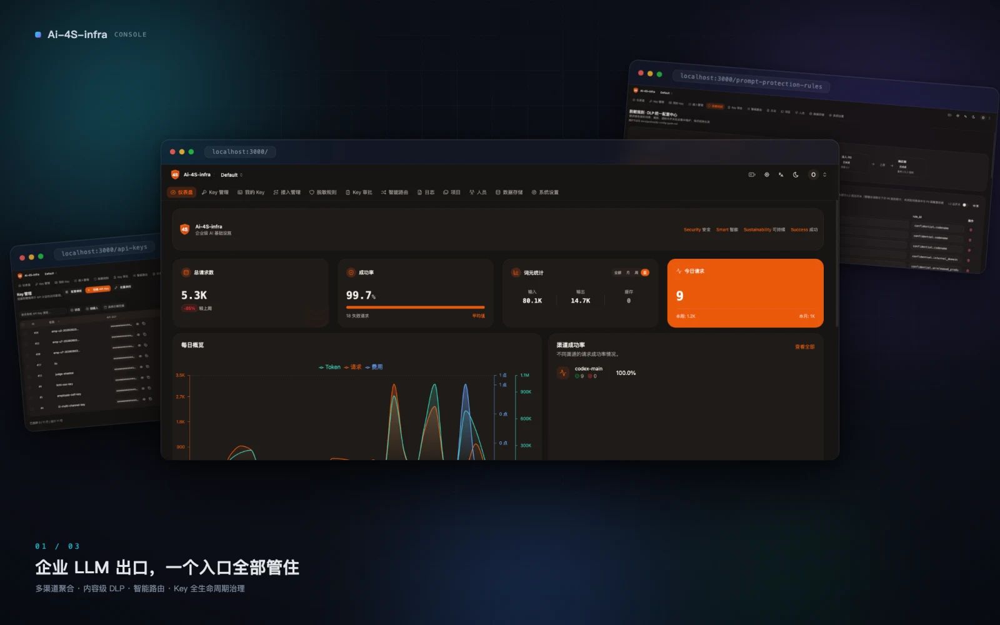
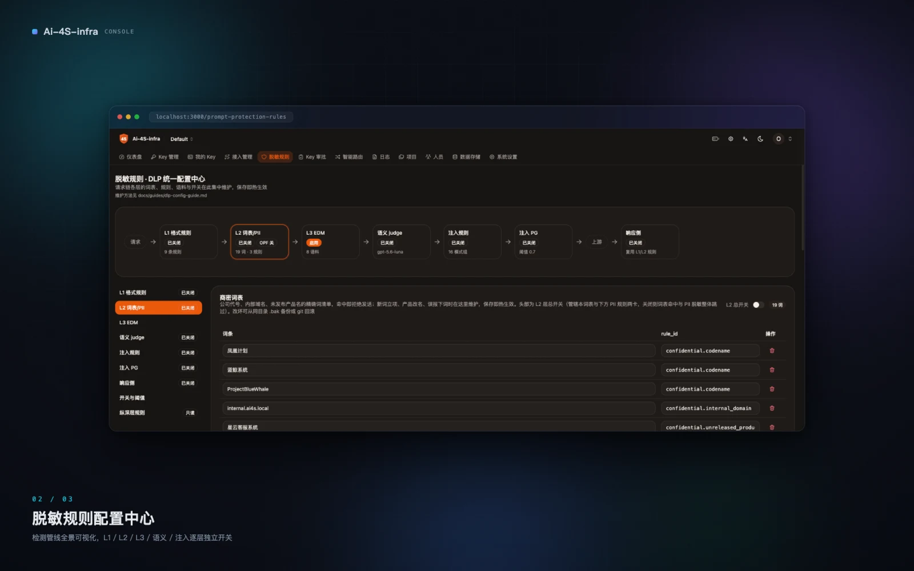
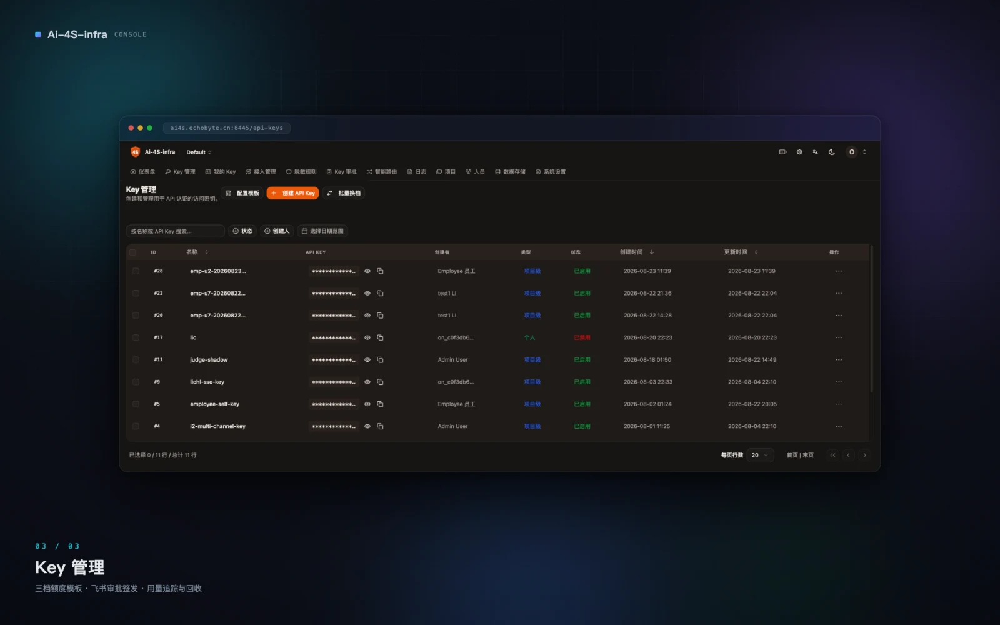
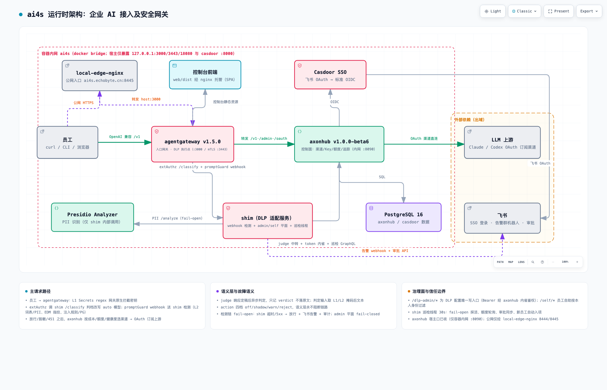

# ai4s — 面向企业的 AI 接入及安全网关

**ai4s = AI for Security · Smart · Sustainability · Success（安全 · 智能 · 可持续 · 成功）**

为企业员工提供统一、安全、可治理的 LLM API 出口：一个 OpenAI 兼容入口，聚合多渠道上游；请求经内容级 DLP 脱敏/阻断与智能路由；员工 Key 审批签发、按档限额、全程可审计。

## 控制台预览



| 脱敏规则配置中心 | Key 管理 |
|---|---|
|  |  |

## 四个 S

- **Security**：密钥、PII、商业机密在发给 LLM 前被检测、脱敏或阻断；全链路审计留痕，语义层永不阻断业务。
- **Smart**：多渠道聚合 + `auto` 智能路由按请求复杂度分档选模型，成本/额度/健康度参与选路，自动故障转移。
- **Sustainability**：员工 Key 全生命周期管理——审批签发、档位额度、用量追踪、回收，成本可控、合规可运营。
- **Success**：员工顺畅用上 AI 而不被安全流程绊住：自助查 Key、审批走飞书、手机 PWA 可用。

## 功能现状

- **统一出口**：OpenAI 兼容 `/v1`，员工入口 `:3000`，设备身份 mTLS `:3443`。
- **内容级 DLP 管线**，逐层可独立开关：
  - L1 格式规则族：Secrets regex 网关原生拦截（reject/mask，覆盖工具调用）+ 归一化变体 PII（分隔/全角/分段容忍）；
  - L2 词表 + PII：商密词表、Presidio ad-hoc 识别器；privacy-filter 中文 NER 已预接线为 L2 内嵌第二检测器（开关缺省关，#127）；
  - L3 EDM 文档指纹：整篇粘贴内部文档命中即 451；
  - 语义 judge（shadow 观测 + 置信度分档告警，永不阻断）与注入双通道（规则正则 + PromptGuard 2 模型打分，可选 451 阻断试点）；
  - 响应侧检测：模型应答命中敏感内容同样处置。
- **智能路由**：`model=auto` 经分类器判档 simple/complex 映射真实模型；会话档位稳定（首轮定档/继承/升档锁、tool-loop/thinking 锁），分类故障 fail-open 落旗舰。
- **Key 治理**：三档额度模板；员工飞书审批自助新建 Key、按 Key 提档；审批通过自动签发并私信交付明文；管理端 Key/项目/成员/额度全图形化。
- **SSO**：Casdoor 枢纽，飞书 OAuth 一键登录，JIT 建号自动入 Default 项目。
- **可观测与告警**：请求追踪；judge/PG/rules/router 判定持久化观测出口；巡检线程 30s（探活、额度、审批同步）+ 飞书群机器人告警与审批卡片。
- **控制台**：仪表盘、Key 管理、脱敏规则配置中心、智能路由管理、日志；PWA 支持 Android 安装与移动端布局。

## 组件与版本

版本 pin 定，升级走评审（ADR-0005）。

| 组件 | 版本 | 角色 |
|---|---|---|
| agentgateway | v1.5.0 | 入口网关 / DLP 执行点（extAuthz + promptGuard webhook） |
| axonhub | v1.0.0-beta6 | 控制面：渠道/Key/额度/追踪 |
| shim | 本地构建（`shim/`） | DLP 适配 + admin/self 平面 + 巡检线程 + PG 进程内推理 |
| Presidio | 2.2.364 | PII 识别（仅 shim 内部调用） |
| opf | 本地构建（`opf/`，profile 默认不启动） | privacy-filter 中文 NER sidecar（预接入） |
| PostgreSQL | 16-alpine | 控制面 / SSO 数据 |
| Casdoor | 3.133.0 | SSO 枢纽：飞书 OAuth → 标准 OIDC |

## 快速开始

```bash
cd deploy
cp .env.example .env       # 填 DB_PASSWORD 与管理面账号；OAuth 凭据可后补
docker compose up -d
./scripts/bootstrap.sh     # 初始化管理账号 + 渠道 + 测试 API key（幂等）
./scripts/smoke-test.sh    # 经入口网关完成一次 chat completion
```

完整组件表、公网发布、DLP 配置面、OPF 启用步骤见 [`deploy/README.md`](deploy/README.md)。

## 本地模型与可选组件（需自行配置）

以下组件有意不入库、默认不启动，按需自行配置——缺省时对应检测能力静默缺席（fail-open，不影响主链路与其余 DLP 层）：

- **PromptGuard 2 注入检测模型**（~284MB）：shim 进程内推理的注入打分引擎（shadow 观测 + 可选 451 阻断试点）。模型文件需自行从 HuggingFace 下载到 `deploy/.local/promptguard-model/`（gitignored），再开 `pg.enabled`。下载命令见 [`deploy/README.md`](deploy/README.md)「PromptGuard 2 模型」节。
- **opf privacy-filter 中文 NER sidecar**（~1.5GB，profile 默认不启动）：L2 内嵌第二检测器，仅适合有 GPU 的机型（CPU 延迟实测不可用，issue #122）。启用步骤见 [`deploy/README.md`](deploy/README.md)「OPF 第二检测器」节。
- **Presidio PII 识别开箱即用**：镜像内置 NLP 模型，中文 ad-hoc 识别器 `recognizers/pii-zh.json` 已入库，无需额外配置。

## 架构



交互版架构图与 DLP 管线图（缩放/聚焦/明暗切换）：[`ai4s-runtime.html`](docs/architecture/ai4s-runtime.html) · [`ai4s-dlp-pipeline.html`](docs/architecture/ai4s-dlp-pipeline.html)，clone 后用浏览器打开。

## 仓库结构

- `deploy/` — Docker Compose 编排、配置、运维/回归脚本（`scripts/`）
- `shim/` — DLP 适配服务（检测路径纯标准库）+ admin/self API + 单测
- `web/` — 控制台前端（React + Vite，构建产物由 web-static nginx 托管）
- `opf/` — privacy-filter sidecar（profile 默认不启动）
- `recognizers/` — 中文 PII recognizer 定义（热更新）
- `docs/` — `adr/` 架构决策、`contracts/` 接口契约、`research/` 调研评测、`architecture/` 架构图产物

## 开发与测试

```bash
# shim 单测（本机 venv，进程内假线路边界）
cd shim && .venv/bin/python tests/test_admin_api.py

# DLP 对抗回归（活栈全链路，~3-4 分钟；改词表/规则/管线后必跑）
cd deploy && python3 scripts/dlp-regression.py

# web 类型检查 + 单测
cd web && npx tsc --noEmit && npm run test:unit
```

纪律：DLP 所有配置（词表/识别器/格式规则/EDM 语料/开关阈值）唯一写入口 = shim admin API `/dlp-admin/*`，控制台「脱敏规则」页是其前端；不直改挂载目录下的 JSON。

## 文档

开发过程文档（ADR、接口契约、调研评测、agents 协作约定等）不随仓库发布，仅保留在维护者本地。仓库内保留 `docs/architecture/`（运行时架构图）与 `docs/showcase/`（控制台预览图）供本 README 引用。

## 许可证

GPL-3.0，见 [LICENSE](LICENSE)。`web/` 内含 vendor 化的第三方代码（shadcn-admin 与 axonhub 控制台，MIT License），其归属声明保留于 `web/NOTICE`、`web/UPSTREAM`。
