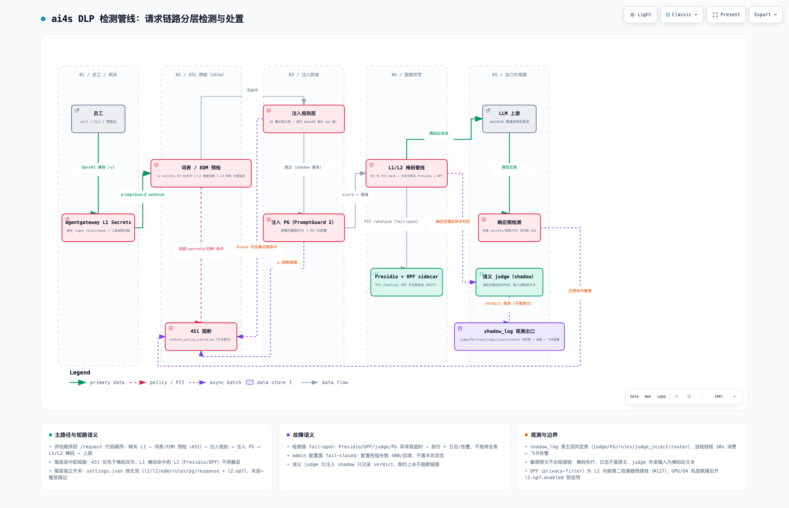

# ai4s — 面向企业的 AI 接入及安全网关

**ai4s = AI for Security · Smart · Sustainability · Success（安全 · 智能 · 可持续 · 成功）**

为企业内部员工提供统一、安全、可治理的 LLM API 出口：一个 OpenAI 兼容入口，后面是多渠道聚合、内容级 DLP 脱敏/阻断、智能路由、员工 Key 全生命周期治理与全链路审计。


> 交互版架构图（缩放/搜索/明暗切换/导出）：[`docs/architecture/ai4s-runtime.html`](docs/architecture/ai4s-runtime.html)（clone 后用浏览器打开；由 archify 生成，showcase 校验 9/9 通过）

## 四个 S

- **Security（安全）**：密钥、PII、商业机密在发给 LLM 前被检测、脱敏或阻断；全链路审计留痕，语义层永不阻断业务。
- **Smart（智能）**：多渠道/多供应商聚合 + `auto` 智能路由（按请求复杂度分档选模型），成本/额度/健康度参与选路，自动故障转移。
- **Sustainability（可持续）**：员工 Key 全生命周期管理（审批签发、档位额度、用量追踪、回收），成本可控、合规可运营。
- **Success（成功）**：员工顺畅用上 AI 而不被安全流程绊住——自助查 Key、审批走飞书、手机 PWA 可用。

## 功能现状

- **统一出口**：OpenAI 兼容 `/v1`（员工入口 `:3000`，设备身份 mTLS `:3443`）；公网经 nginx 发布 `https://ai4s.example.com:8445`。
- **内容级 DLP 管线**（agentgateway + shim 执行，逐层可独立开关）：
  - L1 格式规则族：Secrets regex（网关原生，reject/mask + 工具调用四目标扫描）+ 归一化变体 PII（分隔/全角/分段容忍）；
  - L2 词表 + PII：商密词表、Presidio ad-hoc 识别器；privacy-filter（OPF）中文 NER 已预接线为 L2 内嵌第二检测器（开关缺省关，#127）；
  - L3 EDM 文档指纹：整篇粘贴内部文档命中即 451；
  - 语义 judge（shadow 观测 + 置信度分档告警，永不阻断）与注入双通道（16 组规则正则 + PromptGuard 2 模型打分，可选 451 阻断试点）；
  - 响应侧检测：模型应答命中敏感内容同样处置。

  管线全景（请求链路评估顺序、短路与故障语义见底部卡片）：

  

  > 交互版（缩放/聚焦/明暗切换/导出）：[`docs/architecture/ai4s-dlp-pipeline.html`](docs/architecture/ai4s-dlp-pipeline.html)（clone 后用浏览器打开；由 archify 生成，showcase 校验通过）
- **智能路由**：`model=auto` 请求经分类器判档 simple/complex → 映射真实模型；会话档位稳定（首轮定档/继承/升档锁、tool-loop/thinking 锁），分类故障 fail-open 落旗舰。
- **Key 治理**：三档额度模板（体验/标准/高）；员工飞书审批自助新建 Key、按 Key 提档；审批通过自动签发并私信交付明文；管理端 Key 管理/项目/成员/额度全图形化。
- **SSO 与账号**：Casdoor 枢纽，飞书 OAuth 一键登录，JIT 建号自动入 Default 项目。
- **可观测与告警**：axonhub 请求追踪；judge/PG/rules/router 判定持久化观测出口；shim 巡检线程 30s（探活、额度、审批同步）+ 飞书群机器人告警与审批卡片。
- **控制台**（`web/`，React + Vite + TanStack + Tailwind）：仪表盘、Key 管理、脱敏规则配置中心（管线图 + 分层导航）、智能路由管理、日志；PWA 支持 Android 安装与移动端布局。

## 控制台预览


| 脱敏规则配置中心 | Key 管理 |
|---|---|
|  |  |

## 组件与版本（pin 定，升级走评审）

| 组件 | 版本 | 角色 |
|---|---|---|
| agentgateway | v1.5.0 | 入口网关 / DLP 执行点（extAuthz + promptGuard webhook） |
| axonhub | v1.0.0-beta6 | 控制面：渠道/Key/额度/追踪（只升稳定版，ADR-0005） |
| shim | 本地构建（`shim/`，Python 3.12 stdlib 检测路径） | DLP 适配 + admin/self 平面 + 巡检线程 + PG 进程内推理 |
| Presidio | 2.2.364 | PII 识别（仅 shim 内部调用） |
| opf | 本地构建（`opf/`，profile `opf` 默认不启动） | privacy-filter 中文 NER sidecar（预接入） |
| PostgreSQL | 16-alpine | axonhub / casdoor 数据 |
| Casdoor | 3.133.0 | SSO 枢纽：飞书 OAuth → 标准 OIDC |

## 快速开始

```bash
cd deploy
cp .env.example .env       # 填 DB_PASSWORD 与管理面账号；OAuth 凭据可后补
docker compose up -d
./scripts/bootstrap.sh     # 初始化管理账号 + 渠道 + 测试 API key（幂等）
./scripts/smoke-test.sh    # 经 agentgateway 完成一次 chat completion
```

完整组件表、公网发布、DLP 配置面、OPF 启用步骤等见 [`deploy/README.md`](deploy/README.md)。

## 仓库结构

- `deploy/` — Docker Compose 编排、配置、运维/回归脚本（`scripts/`）
- `shim/` — DLP 适配服务（检测路径纯标准库）+ admin/self API + 单测
- `web/` — 控制台前端（构建产物由 web-static nginx 托管）
- `opf/` — privacy-filter sidecar（OPF，profile 默认不启动）
- `recognizers/` — 中文 PII recognizer 定义（热更新）
- `docs/` — `adr/` 架构决策、`contracts/` 接口契约、`research/` 调研与评测、`architecture/` 架构图产物
- `graphify-out/` — 代码库图谱索引（graphify 产物）

## 开发与测试

```bash
# shim 单测（本机 venv，进程内假线路边界）
cd shim && .venv/bin/python tests/test_admin_api.py

# DLP 对抗回归（活栈全链路，~3-4 分钟；改词表/规则/管线后必跑）
cd deploy && python3 scripts/dlp-regression.py

# web 类型检查 + 单测
cd web && npx tsc --noEmit && npm run test:unit
```

纪律：DLP 所有配置（词表/识别器/格式规则/EDM 语料/开关阈值）唯一写入口 = shim admin API `/dlp-admin/*`，控制台「脱敏规则」页是其前端；不直改挂载目录下的 JSON。

## 文档地图

- 架构决策：[`docs/adr/`](docs/adr/)（0001 控制面选型 / 0002 阶段 1 架构 / 0003 代码复用 / 0004 审计路线 / 0005 升级评审纪律 / 0006 语义层外部 API 路线 / 0007 auto 智能路由）
- 接口契约：[`docs/contracts/dlp-webhook-shim.md`](docs/contracts/dlp-webhook-shim.md)
- 调研评测：[`docs/research/`](docs/research/)（网关脚手架全景、控制面对比、privacy-filter 对标评测等）
- Issue 管理：GitHub Issues（五角色词表 `needs-triage`/`needs-info`/`ready-for-agent`/`ready-for-human`/`wontfix`），见 [`docs/agents/`](docs/agents/)
